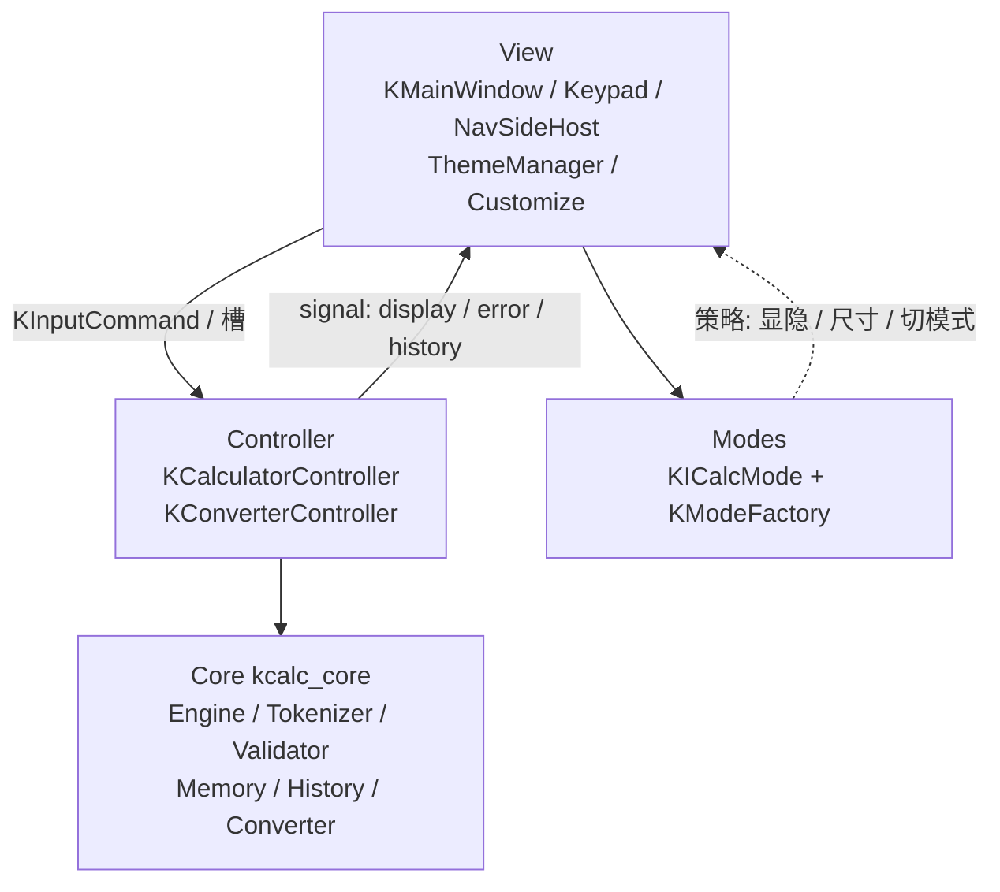
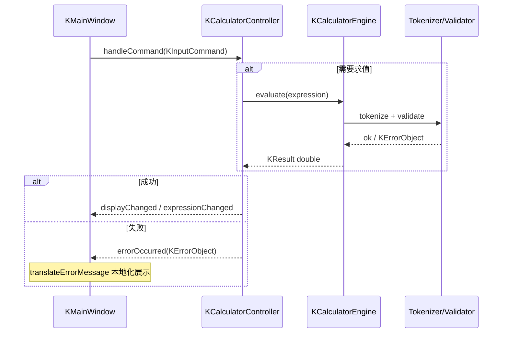

# kcalculator

Qt 5.15 + C++17 企业级桌面计算器（Widgets），满足课程作业《计算器工程版》进阶篇要求，并扩展科学模式、长度/重量换算、皮肤与图标包。

作业需求文档：[计算器工程版大项目](https://365.kdocs.cn/l/caAYLeSt7OBy)

## 技术栈

| 项 | 说明 |
|----|------|
| 语言 / 标准 | C++17 |
| UI | Qt 5.15 |
| 支持平台 | Windows，VMware（ubantu） |
| 依赖 | `thirdparty_install/vcpkg` |
| 单测 | GoogleTest（目标 `test_kcalc`） |

## 环境依赖、运行与支持平台

### 依赖

- CMake ≥ 3.10
- C++17 
- Qt5

### 编译

在项目根目录执行兄弟目录脚本一键编译：

```bat
..\script\build_win.bat
```

### 运行

```bat
..\sample\build_x64_Debug\bin\Debug\kcalculator.exe
```
### 支持平台

- 支持平台：Windows、VMware（ubantu）

## 功能清单

### 基础篇（B-01 ~ B-10）

- 显示区 + 数字键 + `+ - * / =` + `C/CE` + Backspace，Layout 可拉伸
- 整数 / 小数四则运算与连续表达式求值
- 异常处理：除零、非法表达式等不崩溃，状态栏可理解提示
- 键盘：`0-9`、`+ - * /`、Enter、Backspace、Esc
- 扩展：平方、开方、求余（`%` / mod）、求倒、正负号
- 括号：`(1+3)*4+2 = 18`

> **说明**：本项目 `%` 为**求余**（与科学计算器 mod 一致），不是 Windows 原版百分比。

### 进阶篇（A-01 ~ A-05）

- 内存：`MS / MR / M+ / M- / MC`
- 表达式合法性校验器（tokenize / Validator）
- 历史记录（最近 50 条，计算后自动写入）
- 快捷键补全：`( ) .` 等与按钮语义一致
- 边界验证 gtest 覆盖（见 `testreport.md`）
- 皮肤 / 图标可配置：`resource/skins/`、`resource/icons/`，支持亮/暗主题切换

### 扩展能力

- 科学模式：π、e、幂/根、对数、阶乘、三角函数、DEG/RAD/GRAD、2ⁿᵈ、F-E
- 长度 / 重量换算模式
- 标准模式置顶精简布局
- 中英文界面（Qt 国际化）

## 运算符优先级

与引擎实现一致：

1. 括号 `()`
2. 一元负号
3. `* / %`（左结合）
4. `+ -`（左结合）

示例：

| 表达式 | 结果 |
|--------|------|
| `12 + 3 * 6` | `30` |
| `12 + 3 * 6 / 2` | `21`（即 `12 + ((3*6)/2)`） |
| `(1+3)*4+2` | `18` |

## C / CE 语义

| 按键 | 行为 |
|------|------|
| **CE** | 清除当前输入（显示回到 `0`），保留待求值表达式 |
| **C** | 清除输入与整个表达式 |

## 内存操作

| 按键 | 全称 | 功能 |
|------|------|------|
| MC | Memory Clear | 清除内存 |
| MR | Memory Recall | 调出内存值 |
| M+ | Memory Add | 当前显示值加到内存 |
| M- | Memory Subtract | 从内存减去当前显示值 |
| MS | Memory Store | 当前显示值写入内存（覆盖） |

验收链路：`45*3` → MS；`78*2` → M+；MR → `291`。

## 快捷键

| 键 | 动作 |
|----|------|
| `0-9` | 数字 |
| `+ - * / %` | 运算符 |
| `Enter` / `=` | 求值 |
| `Backspace` | 删除 |
| `Esc` | 清空（C） |
| `( )` | 括号 |
| `.` | 小数点 |

## 架构设计

进阶篇要求（ANF）：优秀架构 / 设计模式，`QObject` + signal/slot 解耦 UI 与逻辑，统一错误对象（禁止仅靠 `qDebug`）。

### 设计目标

1. **UI 与业务分离**：View 不求值；算法与状态机在 Controller / Core。
2. **可扩展模式**：标准 / 科学 / 换算共用导航骨架，差异用策略表达。
3. **可测试核心**：`kcalc_core` + Controller 可被 gtest 直接驱动。
4. **可配置外观**：皮肤 / 图标包与业务代码解耦，按资源目录切换。

### 分层架构（MVC）

| 层 | 目录 / 库 | 职责 | 不做什么 |
|----|-----------|------|----------|
| **View** | `ui/` | 布局、按键、显示、主题应用、快捷键映射 | 不写四则/科学算法 |
| **Controller** | `src/controller/` | 输入状态机、内存/历史作用域、发 UI 信号 | 不直接操作 QSS / 控件几何细节 |
| **Modes（UI 策略）** | `src/modes/` | 回答「显什么、窗口多大、切模式是否清引擎」 | 不拥有 widget，不做求值 |
| **Model / Core** | `src/core/` + `include/kcalc/`（`kcalc_core`） | 分词、校验、求值、内存、历史、单位换算、错误码 | 不依赖 Widgets |



依赖方向固定为 **View → Controller → Core**；Modes 只被 View 查询，反向不依赖 UI。

### 一次按键的数据流



### 模式切换与换算边界

1. 导航选择 modeId → `KModeFactory::create` → 替换 `m_activeMode`（`KICalcMode`）。
2. 按 `clearsEngineOnSwitchFrom` 决定是否对算术引擎 `Clear`；标准/科学切换历史作用域。
3. 换算模式：`isConverter()` 时隐藏算术显示/键区/历史侧栏，显示 `KConverterPane`。
4. 换算走独立 `KConverterController`（`configureAsLength` / `configureAsWeight` 注入换算函数），**不经过** `KCalculatorEngine`。

### 错误处理链路

```
Core: KErrorCode + KErrorObject（英文 message）
  → KResult<T>（不抛异常贯穿 UI）
  → Controller: emitError → errorOccurred / m_errorState
  → View: translateErrorMessage → 状态栏 / 显示区
```

C / CE 清除错误态后可继续输入。

---

## 设计模式

| 模式 | 在本项目中的落点 | 解决的问题 |
|------|------------------|------------|
| **MVC** | View=`KMainWindow`；Controller=`KCalculatorController` / `KConverterController`；Model=`kcalc_core` | UI 与算法分离，便于单测与换皮 |
| **Strategy（策略）** | `KICalcMode` ← `KStandardMode` / `KScientificMode` / `KLengthMode` / `KWeightMode` | 模式差异（显隐、尺寸、是否清引擎）可插拔，避免巨型 `if/else` |
| **Factory（工厂）** | `KModeFactory::create(id)`；换算窗格 `KConverterPane::createLengthPane/WeightPane` | 按 id 创建策略实例，导航与实现解耦 |
| **Observer（观察者）** | Qt signal/slot：`displayChanged` / `errorOccurred` / `historyChanged`；`KThemeManager::themeChanged` | Controller / 主题变更通知 UI |


### 扩展点

| 扩展 | 做法 |
|------|------|
| 新计算器模式 | 实现 `KICalcMode`，在 `KModeFactory` 注册 id |
| 新换算类别 | Core 增加换算表 + `configureAsXxx` 注入；UI 增加 Pane |
| 新皮肤 / 图标包 | 在 `resource/skins/<name>/`、`resource/icons/<name>/` 放 QSS/SVG，由 Customize 选择 |
| 新按键语义 | 扩展 `KInputCommand`，在 `handleCommand` 与键区映射中接线 |

## 目录结构

```
kcalculator/
├── CMakeLists.txt
├── README.md                 # 本说明（含设计）
├── testreport.md             # 边界验证与验收报告
├── include/kcalc/            # kcalc_core 公共头文件
├── src/
│   ├── core/                 # 引擎、校验、内存、历史、换算
│   ├── controller/           # 控制器（QObject）
│   └── modes/                # 模式策略 / 工厂
├── ui/                       # Widgets UI
├── resource/                 # QSS、图标、皮肤包
└── test/gtest/               # GoogleTest 用例
```

## 测试

```bat
cmake --build build --config Debug --target test_kcalc
build\bin\Debug\test_kcalc.exe
```

行覆盖率（需已安装 [OpenCppCoverage](https://github.com/OpenCppCoverage/OpenCppCoverage)）：

当前 Debug 全量约 **86.8%** 行覆盖，详见 [`testreport.md`](testreport.md)。  

## 交付对照

| 提交物 | 本仓库 |
|--------|--------|
| 源码（可编译） | ✅ |
| README（运行 + 功能 + 设计说明） | ✅ 本文档 |
| 测试用例验证报告 | ✅ `testreport.md` |
| 自动化测试 | ✅ `test_kcalc`（gtest） |
| 可执行 exe | 按课程要求单独打包提交 |
